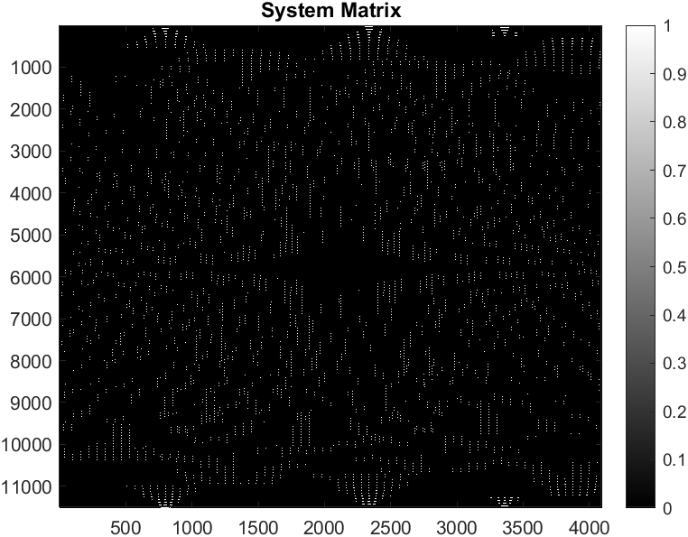
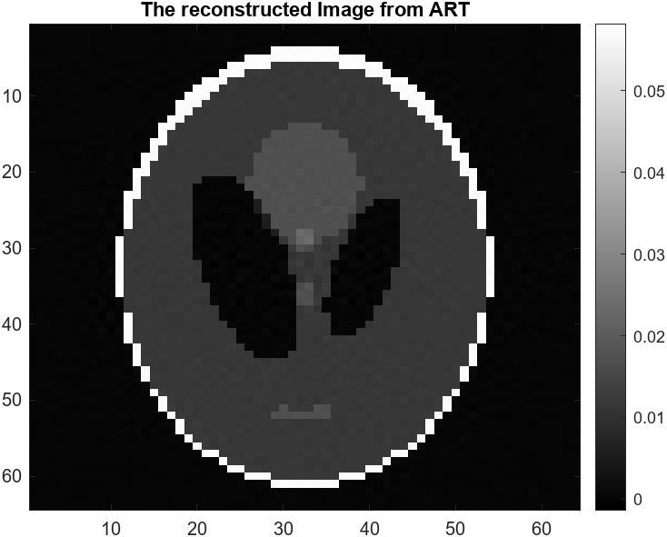

# CT_Iterative_Reconstruction

This repository contains MATLAB implementations of three different algorithms for CT reconstruction: Algebraic Reconstruction Technique (ART), Simultaneous Iterative Reconstruction Technique (SIRT), and Simultaneous Algebraic Reconstruction Technique (SART).

## Table of Contents

- [Introduction](#introduction)
- [Installation](#installation)
- [Usage](#usage)
- [System Matrix Generation](#system-matrix-generation)
- [ART Implementation](#art-implementation)
- [SIRT Implementation](#sirt-implementation)
- [SART Implementation](#sart-implementation)
- [Results](#results)
- [License](#license)
- [Acknowledgements](#acknowledgements)

## Introduction

Computed Tomography (CT) reconstruction is a vital process in medical imaging, allowing the reconstruction of cross-sectional images from projection data. This repository provides MATLAB implementations of three popular CT reconstruction algorithms, each with its own approach to reconstructing the image from the acquired data.


## Installation

1. Clone this repository to your local machine using:
    ```
    git clone https://github.com/Nakul-Hari/CT_Iterative_Reconstruction.git
    ```
2. Open MATLAB and navigate to the cloned repository directory.

## Usage

Each MATLAB script can be run independently to perform the respective Iterative Reconstruction Technique. Below are the descriptions of each script and their usage.


## System Matrix Generation

The `SystemMatrix.m` script generates the system matrix required for CT reconstruction. It calculates the mapping between the projection space and the image space, taking into account parameters such as the number of detectors, angles, and image dimensions.



## ART Implementation

The Algebraic Reconstruction Technique (ART) is an iterative algorithm for CT reconstruction. ART updates the image estimate by iteratively back-projecting the error between the measured and estimated projections. It reconstructs the image pixel by pixel, updating each pixel's value based on the contribution of each projection.

ART is computationally efficient and particularly useful for sparse or limited-angle CT data. However, it may converge slowly, especially for large image sizes or noisy data.



## SIRT Implementation

The Simultaneous Iterative Reconstruction Technique (SIRT) is another iterative algorithm for CT reconstruction. SIRT updates the image estimate by iteratively minimizing the discrepancy between the measured and estimated projections. Unlike ART, SIRT updates the entire image simultaneously, using a weighted combination of measured and estimated projections.

SIRT typically converges faster than ART and is less sensitive to noise. However, it may introduce streak artifacts in the reconstructed image, especially with limited-angle data.


## SART Implementation

The Simultaneous Algebraic Reconstruction Technique (SART) combines the advantages of ART and SIRT. SART iteratively updates the image estimate using a weighted combination of measured and estimated projections, iterating randomly through detector angles to achieve faster convergence.

SART is computationally efficient and offers improved convergence compared to ART, making it suitable for various CT reconstruction applications. It provides high-quality reconstructions with reduced artifacts, even with limited-angle or noisy data.


## Results

The `Images` directory contains sample images and data generated from the implementations of ART, SIRT, and SART algorithms. These results showcase the reconstructed images and convergence behavior of each algorithm, providing insights into their performance and effectiveness.

**Algebraic Reconstruction Technique** Algorithm converges the phantom
image with an error less than 0.1 within **43 iterations**.

**Simultaneous Iterative Reconstruction Technique** Algorithm converges
the phantom image with an error less than 0.1 within **417 iterations**.
Although the number of iterations was far more than that for the ART
each iteration took way **less time than ART**.

**Simultaneous Algebraic Reconstruction Technique** Algorithm converges
the phantom image with an error less than 0.1 within **6 iterations**. The
number of iterations and time for each iteration is far less compared to
the above iterations and each iterations we relatively **fast than ART** but
**slower than SIRT**, iterating randomly thoroughly the detector angles
yields a faster convergence in SART


## License

This project is licensed under the MIT License - see the [LICENSE](LICENSE) file for details.

## Acknowledgements

This implementation is part of the course work for EE5613: Medical Imaging: Unveiling CT Imaging from Physics to AI Advancements
